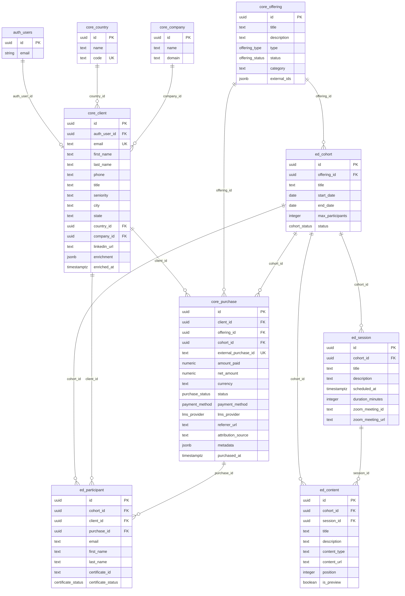

# Data Model

## Entity Relationship Diagram



## Table Reference

### Reference Tables

| Table | Purpose |
|---|---|
| `core_country` | Country lookup (name, ISO code) |
| `core_company` | Company lookup (name, domain) for client profiles |

### Core Tables

**`core_offering`** — Educational products sold by Arkandia.

- Types: workshop, course, saas_subscription, consulting, master_class
- Status lifecycle: draft → published → closed → archived
- `external_ids` (JSONB): tracks IDs from external LMS platforms (Gumroad product IDs, etc.)

**`core_client`** — Customer/user profiles.

- `auth_user_id`: links to `auth.users.id` (Supabase GoTrue). This is the bridge that connects a Campus login to a customer record.
- `enrichment` (JSONB): third-party data enrichment (company info, seniority). `enriched_at` tracks when.
- Location: city, state, country_id, company_id
- Professional: linkedin_url, title, seniority

**`core_purchase`** — Purchase transactions linking clients to offerings.

- `lms_provider`: which platform the sale came from (gumroad, hotmart, cursosmz, youtube, manual, in_person)
- `cohort_id`: optional — links to a specific cohort when applicable
- `external_purchase_id`: unique ID from the external platform
- Financial: amount_paid, net_amount, currency, payment_method
- Attribution: referrer_url, attribution_source, metadata (JSONB)

### Education Tables

**`ed_cohort`** — Specific runs of an offering (e.g., "March 2025 cohort of Workshop de Arquitectura").

- Links to `core_offering`
- Has start/end dates and max_participants
- Status lifecycle: draft → published → active → completed → cancelled

**`ed_content`** — Content items belonging to a cohort.

- Types: `video`, `download`, `link`
- `session_id`: nullable FK to `ed_session` — NULL means general cohort resource, non-NULL means session-specific content
- `position`: integer for display ordering within a cohort
- `is_preview`: whether the item is available as a free preview
- Indexed on `(cohort_id, position)` for ordered retrieval; also indexed on `session_id`

**`ed_session`** — Scheduled or recorded live sessions within a cohort.

- `description`: optional text description for the session
- Zoom integration: `zoom_meeting_id`, `zoom_meeting_url`
- `scheduled_at` and `duration_minutes` for calendar context

**`ed_participant`** — Enrollment records linking clients to cohorts.

- Links: cohort_id, client_id, purchase_id
- Certificate tracking: `certificate_id`, `certificate_status` (pending, issued, failed)

### Auth Tables (managed by GoTrue)

The `auth` schema is created and managed by Supabase GoTrue. Campus does not modify these tables directly. The only touchpoint is `auth.users.id`, which is referenced by `core_client.auth_user_id`.

## Enum Types

| Enum | Values |
|---|---|
| `offering_type` | workshop, course, saas_subscription, consulting, master_class |
| `offering_status` | draft, published, closed, archived |
| `purchase_status` | pending, completed, refunded, failed |
| `payment_method` | card, paypal, pse, bank_transfer |
| `lms_provider` | gumroad, hotmart, cursosmz, youtube, manual, in_person |
| `cohort_status` | draft, published, active, completed, cancelled |
| `certificate_status` | pending, issued, failed |

## The Auth-to-Client Bridge

The join chain that powers Campus access control:

```
auth.users.id → core_client.auth_user_id → core_purchase.client_id → core_offering.id
```

1. User logs in → GoTrue issues JWT with `sub` = `auth.users.id`
2. Backend extracts `sub` from JWT
3. Queries `core_client` WHERE `auth_user_id = sub`
4. Joins through `core_purchase` to find which `core_offering` records the user has access to
5. For offering detail, joins through `ed_cohort` to `ed_content` to get the content list

**Why it's manual:** Customer records (`core_client`) predate Campus auth. Purchases were imported from external platforms before Campus existed. Linking `auth_user_id` is a manual step after a user registers — there is no automatic matching yet.

## Row-Level Security (RLS)

| Table | Policy | Rule |
|---|---|---|
| `ed_content` | `ed_content_select_published` | Anyone can read content from cohorts with status `published`, `active`, or `completed` |
| `ed_content` | Writes | Require `service_role` (backend uses admin connection) |

All other tables are accessed exclusively through the backend API, which filters by authenticated user.

