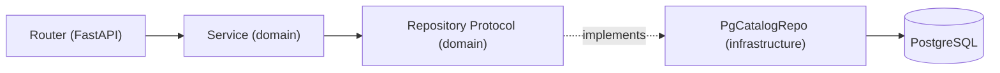
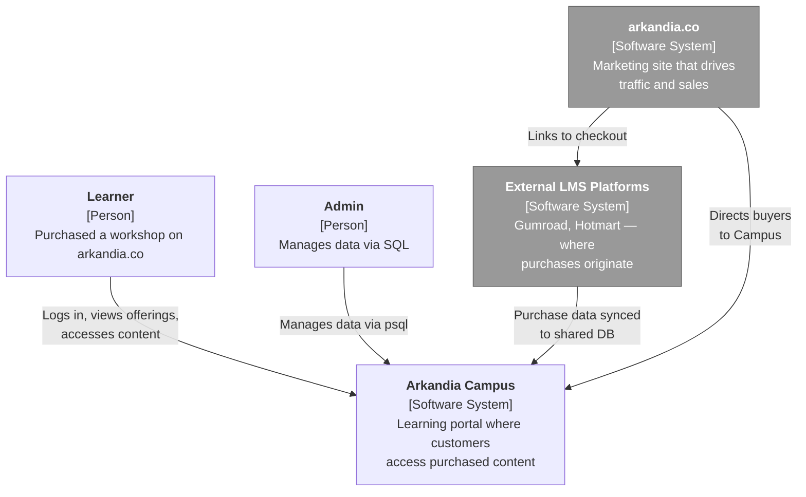
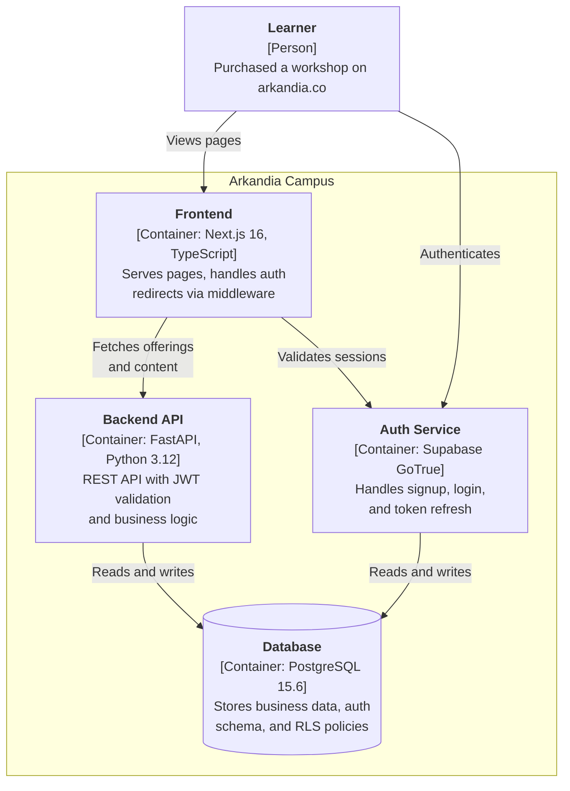

# Architecture

## Quality Attributes

| Priority | Attribute | Rationale |
|---|---|---|
| 1 | **Simplicity** | Hexagonal architecture with thin service layer. Easy to understand and modify for a small team. |
| 2 | **Deployability** | Single-server Docker Compose deployment. One `git pull && docker compose up` deploys everything. No cloud orchestration complexity. |
| 3 | **Modifiability** | Domain layer has zero framework imports. Swapping a repository requires only a new Protocol implementation. Frontend uses server components for easy data flow. |

## Architecture Patterns

### Backend: Hexagonal Architecture

The backend follows hexagonal (ports and adapters) architecture with two layers:

```
backend/app/
├── domain/              # Pure business logic — no framework deps
│   ├── models/          # Pydantic data schemas
│   ├── repositories/    # Abstract interfaces (Protocol)
│   └── services/        # Business logic calling repos
└── infrastructure/      # Framework-aware implementations
    ├── auth/            # JWT validation (JWTBearer)
    ├── persistence/     # asyncpg SQL repositories
    └── routers/         # FastAPI HTTP handlers
```

**Key rule:** Domain never imports from infrastructure. Infrastructure implements domain Protocols.



Dependencies are injected via `app/dependencies.py`, which wires infrastructure implementations to domain Protocols.

### Frontend: Next.js App Router

- **Server components** are the default — used for dashboard, product detail, and all data-fetching pages
- **Client components** only where interactivity is required: login form, register form, navbar logout
- **Middleware** (`src/proxy.ts`) handles auth redirects: unauthenticated users go to `/login`, authenticated users on `/login` go to `/dashboard`
- **Dual URL pattern:** Server-side requests use Docker-internal URLs (`API_INTERNAL_URL`, `SUPABASE_INTERNAL_URL`); browser requests use public URLs (`NEXT_PUBLIC_API_URL`, `NEXT_PUBLIC_SUPABASE_URL`)

## C4 Context Diagram



## C4 Container Diagram



## Tech Stack

| Layer | Technology | Version | Notes |
|---|---|---|---|
| Backend | FastAPI + asyncpg | Python 3.12 | Hexagonal arch, Protocol-based repos, `uv` for deps |
| Frontend | Next.js + React + Tailwind CSS | 16 / 19 / 4 | TypeScript strict, app router, `pnpm` for deps |
| Database | PostgreSQL | 15.6 (supabase image) | RLS enabled, raw SQL (no ORM) |
| Auth | Supabase GoTrue | v2.170.0 | Self-hosted, email + password, JWT (HS256) |
| API Gateway | Kong | 3.4 | Declarative config (no DB), routes `/auth/v1/*` |
| Reverse Proxy | Caddy | 2-alpine | Auto TLS via Let's Encrypt, production only |
| Dev tools | ruff, pyright, ESLint, vitest, pytest | — | `make check` runs all linters and tests |

