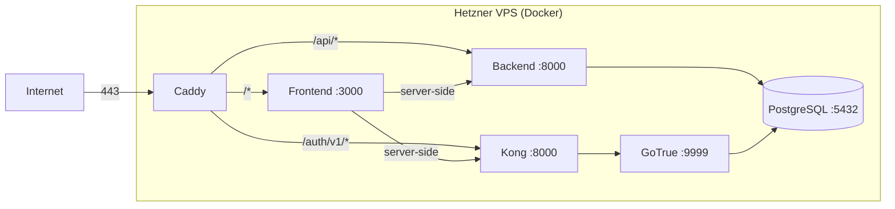

# Infrastructure

## Local Development

### Prerequisites

- **Docker** and Docker Compose (for running all services)
- **pnpm** (for running frontend checks locally)
- **uv** (for running backend checks locally)

### Quickstart

```bash
cp .env.example .env       # defaults work for dev
make dev                    # starts all 5 services
make db-init                # baseline tables + campus migrations (first time only)
make db-seed                # optional sample content
```

After registering a user, link them to a client record:

```bash
make db-psql
UPDATE core_client SET auth_user_id = '<id from auth.users>' WHERE email = '<email>';
```

### Services and Ports

| Service | Image | Port | URL |
|---|---|---|---|
| Frontend | custom (Next.js) | 3000 | http://localhost:3000 |
| Backend | custom (FastAPI) | 8000 | http://localhost:8000 |
| Kong (Auth gateway) | kong:3.4 | 8443 | http://localhost:8443 |
| GoTrue (Auth) | supabase/gotrue:v2.170.0 | 9999 | Internal only |
| PostgreSQL | supabase/postgres:15.6.1.145 | 5432 | `make db-psql` |

### Hot Reload

- **Backend:** `backend/app` is bind-mounted; uvicorn runs with `--reload`
- **Frontend:** `frontend/` is bind-mounted; Next.js dev server watches for changes

### Key Environment Variables

Defined in `.env` (copied from `.env.example`):

| Variable | Purpose |
|---|---|
| `POSTGRES_PASSWORD` | Database password (shared by all services) |
| `SUPABASE_JWT_SECRET` | Signs and verifies JWT tokens (must be 32+ chars) |
| `SUPABASE_ANON_KEY` | Pre-generated JWT with `role: anon` for Supabase client |
| `SUPABASE_URL` | Public URL for Supabase Auth (Kong endpoint) |
| `NEXT_PUBLIC_SUPABASE_URL` | Same as above, exposed to browser |
| `NEXT_PUBLIC_API_URL` | Public URL for the backend API |
| `SUPABASE_INTERNAL_URL` | Docker-internal URL for server-side auth calls (`http://kong:8000`) |
| `API_INTERNAL_URL` | Docker-internal URL for server-side API calls (`http://backend:8000`) |

The dual-URL pattern (`SUPABASE_INTERNAL_URL` vs `NEXT_PUBLIC_SUPABASE_URL`) exists because the frontend's server components run inside Docker and need container-network URLs, while the browser needs public URLs.

## Database Initialization

Two-phase approach:

1. **Baseline** (`database/schema/baseline.sql`) — creates core business tables that predate Campus
2. **Migrations** (`database/migrations/001-005`) — Campus-specific schema changes applied sequentially

**Important:** GoTrue must start first. It creates the `auth` schema and `auth.users` table on first boot. The Makefile's `db-baseline` target waits for Postgres readiness and sleeps 5 seconds for GoTrue migrations to complete.

See [database/docs/data-model.md](../../database/docs/data-model.md) for full schema documentation.

## Production Deployment

### Server

Single **Hetzner VPS** running all services via Docker Compose.

- Config: `infra/docker-compose.prod.yml`
- 6 services: db, gotrue, kong, backend, frontend, **caddy**
- Only ports 80 and 443 are exposed (Caddy)
- All services connect via `campus_network` (Docker bridge network)
- `restart: unless-stopped` on all services

### Caddy Routing

Defined in `infra/Caddyfile`:

```
campus.arkandia.co {
    /api/*      → backend:8000
    /auth/v1/*  → kong:8000
    *           → frontend:3000
}
```

TLS is automatic via Let's Encrypt. No manual certificate management.

### Network Topology



## CI/CD Pipeline

**Workflow:** `.github/workflows/deploy.yml`

- **Trigger:** Push to `main` branch
- **Runner:** `ubuntu-latest` (GitHub-hosted)
- **Mechanism:** SSH into Hetzner VPS via `appleboy/ssh-action`

Steps:
1. SSH into the deployment server
2. `git pull origin main`
3. `docker compose --env-file .env -f infra/docker-compose.prod.yml build`
4. `docker compose --env-file .env -f infra/docker-compose.prod.yml up -d`

### Required GitHub Secrets

| Secret | Description |
|---|---|
| `DEPLOY_HOST` | Hetzner VPS IP address |
| `DEPLOY_USER` | SSH user (e.g., `deploy`) |
| `DEPLOY_SSH_KEY` | Private SSH key for authentication |

There is no CI test/lint step — checks are run locally before pushing.

## Server Setup

One-time setup script: `infra/setup-server.sh`

What it does:
1. Installs Docker and Docker Compose
2. Creates a `deploy` user with SSH key access
3. Clones the campus repository

Post-setup manual steps:
1. Copy `.env` with production values (strong passwords, SMTP config, public URLs)
2. Start services: `docker compose -f infra/docker-compose.prod.yml up -d`
3. Initialize database: run baseline + migrations
